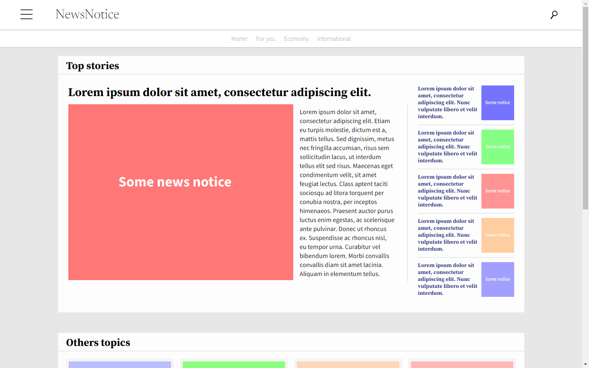
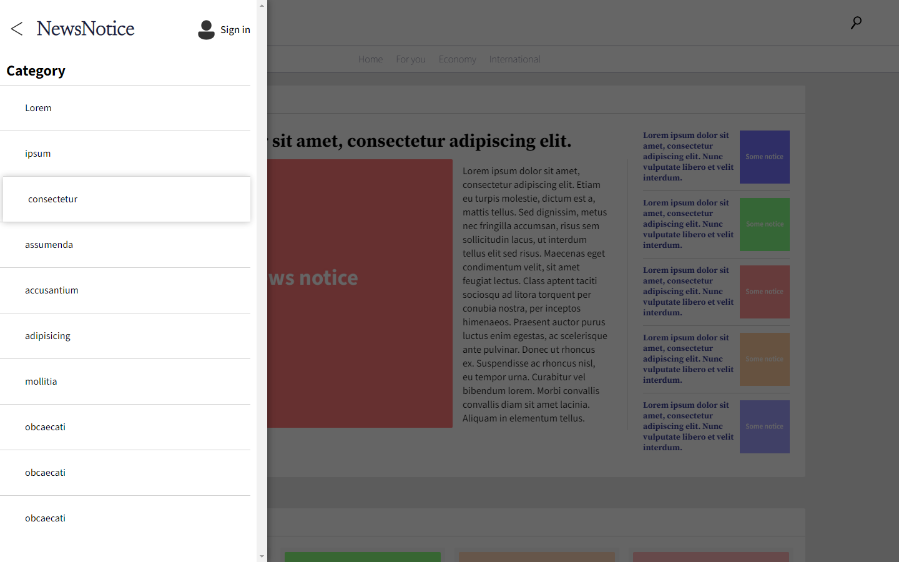
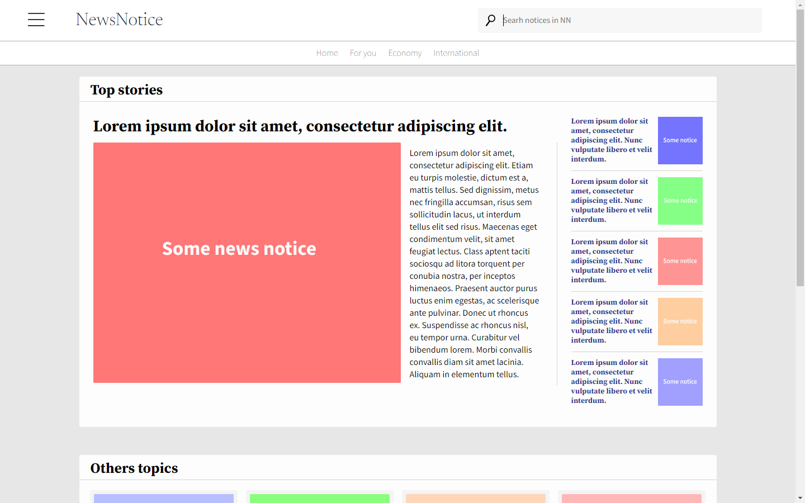
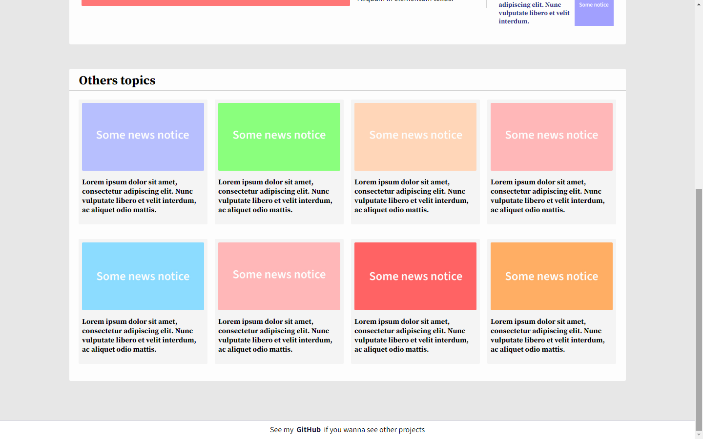

# NewsNotice
Site responsivo de noticias.

Esse projeto é com a intenção de praticar HTML e CSS usando eles para fazer uma página de notícias. 

## Algumas coisas que eu usei
Usei CSS pra fazer algumas animações no menu usando transition e keyframes, flex box para a posição e responsividade do site junto com media queries.
Vários outros conceitos foram usados que podem ser visto no código.

## Capturas de tela

